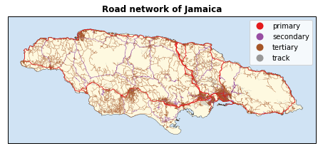

=====================
Example
=====================

This small example will show how to estimate the length of the roads in a single country. 

The first step is to load the function *single_country* from the *length* file.

.. parsed-literal::

    from length import single_country
    import os
    %matplotlib inline  

The **single_country** function requires a *base_path*, the country's name and a path string to the osm file of the continent. We will first identify the *base_path*. The two dots indicate that the base_path redirects us to the parent directory.

.. parsed-literal::

    base_path =   os.path.join(os.path.dirname("__file__"),'..')

For this example, we will use Jamaica. The input for a country is its ISO3 classification.

.. parsed-literal::

    country = 'JAM'
    continent_osm = os.path.join(base_path,'osm_continent','%s-latest.osm.pbf' % ('central-america'))

And finally, we run the code.

.. parsed-literal::

    single_country(country,continent_osm,base_path,overwrite=False,savefig=True)

The code will indicate if the script has started. Any errors will be printed as well.

.. parsed-literal::

    JAM started!
    
The final output produces the length (in km) of the five road categories.

.. raw:: html

    

    
    <table border="1" class="dataframe">
      <thead>
        <tr style="text-align: center;">
          <th></th>
          <th>JAM</th>
        </tr>
        <tr>
          <th>roads</th>
          <th></th>
        </tr>
      </thead>
      <tbody>
        <tr>
          <th>other</th>
          <td>73.719033</td>
        </tr>
        <tr>
          <th>primary</th>
          <td>910.035749</td>
        </tr>
        <tr>
          <th>secondary</th>
          <td>837.407983</td>
        </tr>
        <tr>
          <th>tertiary</th>
          <td>8483.579909</td>
        </tr>
        <tr>
          <th>track</th>
          <td>1130.414847</td>
        </tr>
      </tbody>
    </table>
    

And, if the option *Report* is set to **False**, a figure with the roads of the selected country will be plotted and saved to the *Figures* directory.

